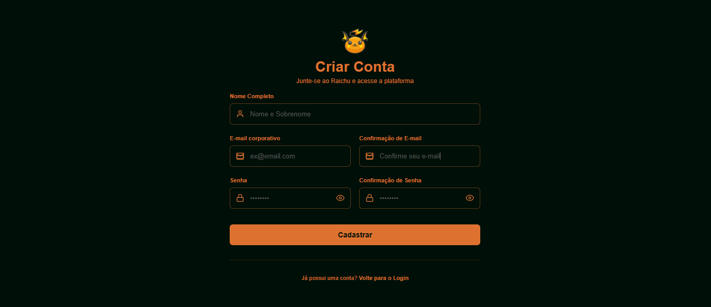
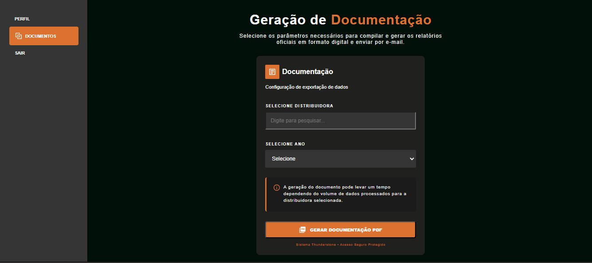
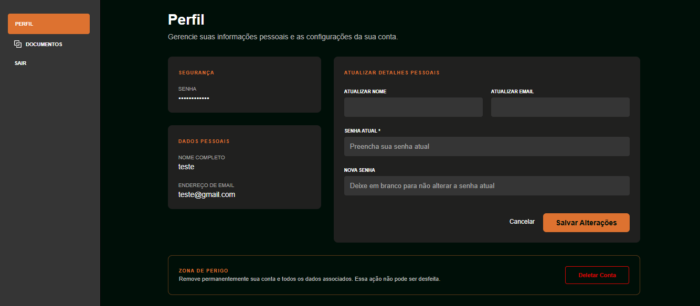
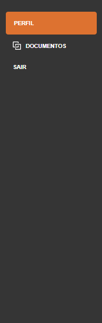

# User Manual – Raichu System (Thunderstone)

## Overview
This document provides a step-by-step guide to using the Raichu secure access system, a platform designed for data processing and documentation generation.

---

## 1. Account Creation (Sign Up)

Before accessing the system, a corporate account must be created.

### Steps
1. Access the homepage and click **"Sign Up Now"**, or navigate directly to the registration page.  
2. Fill in the required fields:
   - **Full Name**: Enter your first and last name  
   - **Corporate Email & Confirmation**: Enter and confirm your email address  
   - **Password & Confirmation**: Minimum of 6 characters (use the visibility toggle if needed)  
3. Click **"Sign Up"**  

### Result
- A success screen will be displayed  
- Click **"Back to Login"** to proceed  

---

## 2. System Access (Login)

After account creation, access the system through the login page.

### Steps
1. Enter your **Corporate Email** and **Password**  
2. Click **"Sign In"**

### Important
- Authentication is handled via security tokens  
- Upon successful login, you will be redirected automatically to the main dashboard  

---

## 3. Documentation Generation (Home / Documents)

This is the main functionality of the system.

### Steps
1. Locate the **Data Export Configuration** section  
2. In **"Select Distributor"**:
   - Type or select a distributor from the list  
3. In **"Select Year"**:
   - Choose the desired year (options depend on the selected distributor)  
4. Click **"Generate PDF Documentation"**

### Result
- A success message will confirm submission  
- Processing occurs in the background  
- Generation time depends on data volume  

---

## 4. Profile Management

User data and credentials can be managed in the Profile section.

### Access
- Navigate via the sidebar and click **"Profile"**

---

### 4.1 Updating Information

### Steps
1. Enter updated data in the form:
   - Name, Email, and/or Password  
2. Provide your **Current Password** (required for validation)  
3. (Optional) Enter a **New Password**  
4. Click **"Save Changes"**

### Result
- You will be required to log in again with updated credentials  

---

### 4.2 Deleting Your Account (Danger Zone)

### Steps
1. Scroll to the bottom of the Profile page  
2. Click **"Delete Account"**  
3. Confirm the action  

### Important
- This action is irreversible  
- All user data will be permanently deleted  
- You will be redirected to the login screen  

---

## 5. Logout

To securely end your session:

### Steps
1. Click **"Logout"** in the sidebar  

### Result
- Authentication tokens are cleared  
- You are redirected to the login screen  

---